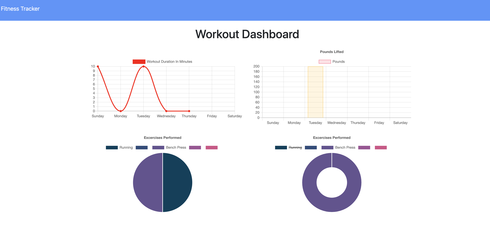

# workout-tracker
About the Project:

A fitness application for users to view, add, create, and track workout.

Screenshot of Application:

Main Page

Stats Page

Description of Project:

-MongoDB

-Javascript

-Node.js
  
    -express
   
    -mongoose

Installation and Application Start Guide for Local Usage:

1. Run npm install to install all dependencies.
2. Run node server.js on terminal/bash to run the server.
3. Type localhost:3000 on web brower to  start application.

Deployed Link on Heroku:

https://jb-workout-tracker-app.herokuapp.com/

